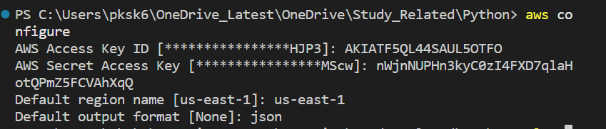

## How to configure AWS account with access keys

`aws configure --profile jatinadmin-general`

- After this enter the Access ID, Access Key and region 

## How to list existing AWS s3 buckets

`aws s3 ls --profile jatinadmin-general`

## How to connect to an Ec2 instance

`ssh -i <PEM_Key_path> username@domain`

## How to create customized userprofile to have unique access key and secret key for each user using the CLI

`aws configure --profile dev`

