## Route53 Fundamentals

[https://learn.cantrill.io/courses/1820301/lectures/41301634]

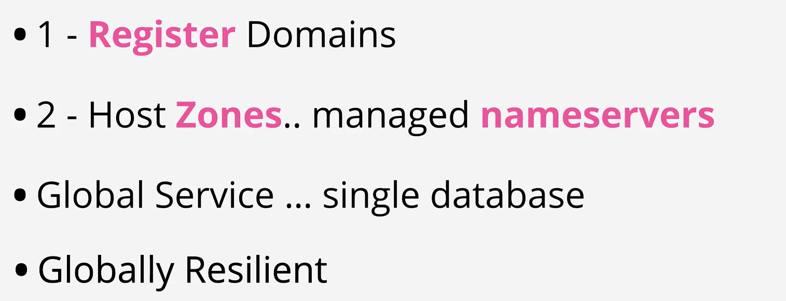

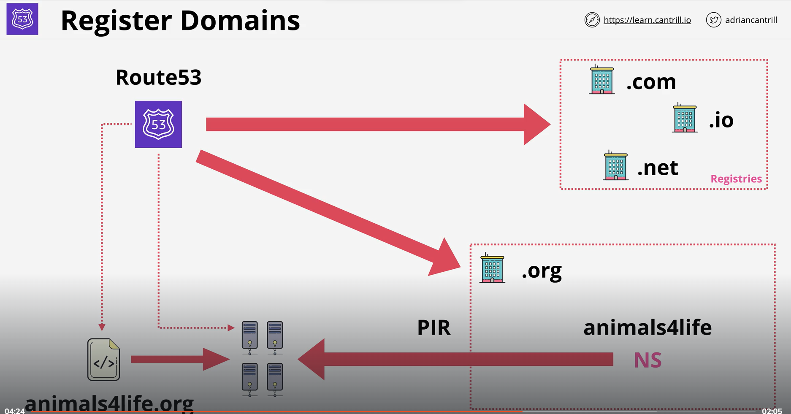

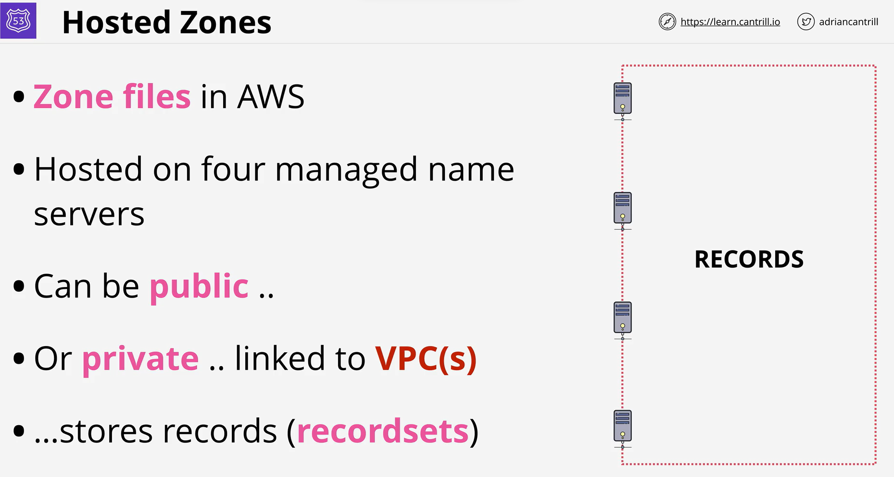

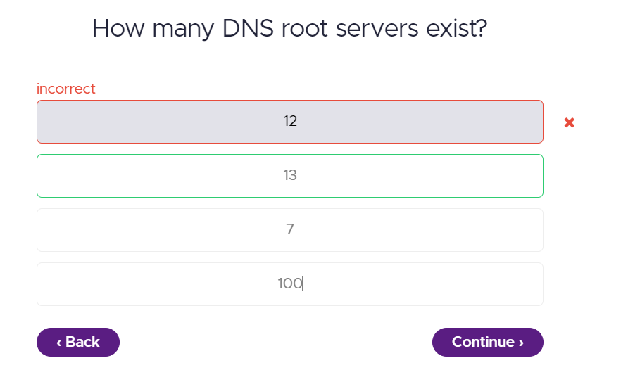

## Route 53 (Registering a Domain Handson)

[https://learn.cantrill.io/courses/1820301/lectures/41301635]

## DNS Record Types

[https://learn.cantrill.io/courses/1820301/lectures/41301636]

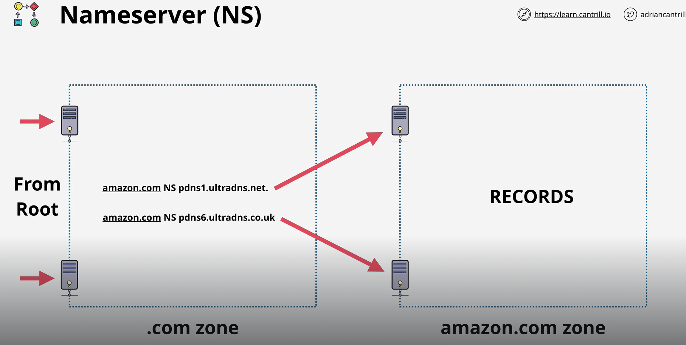

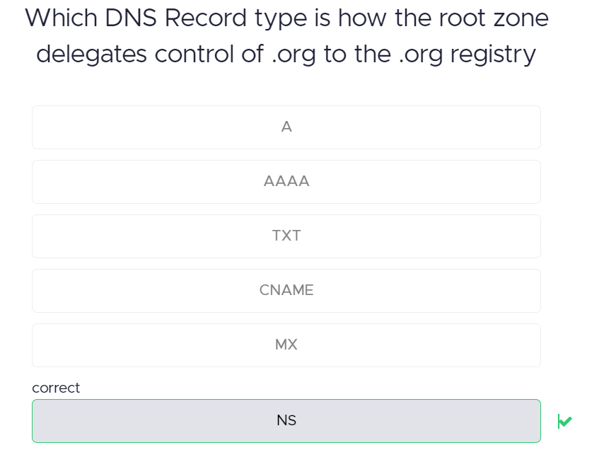

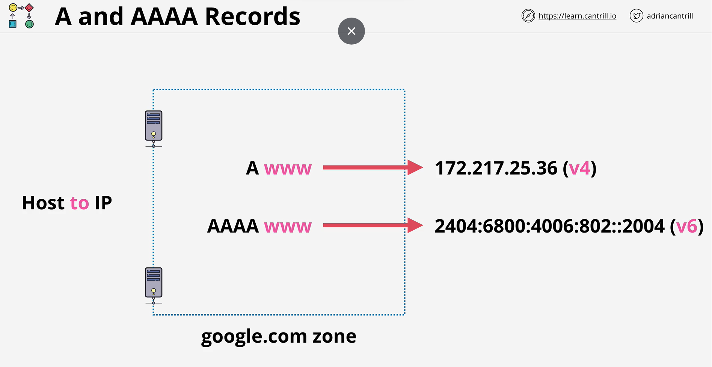

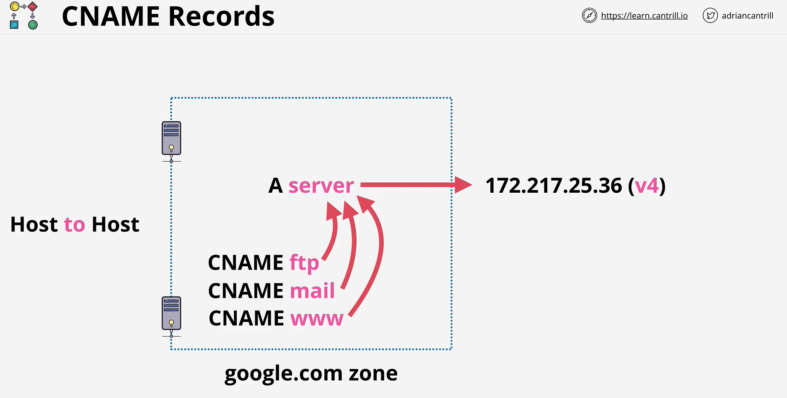

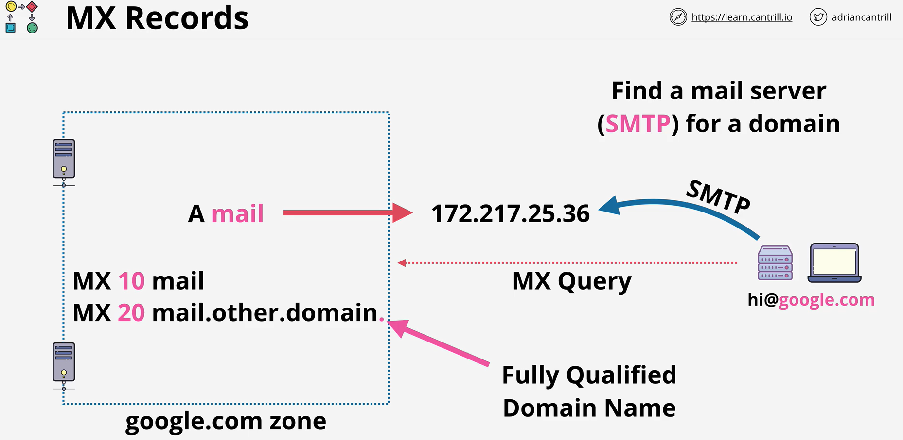

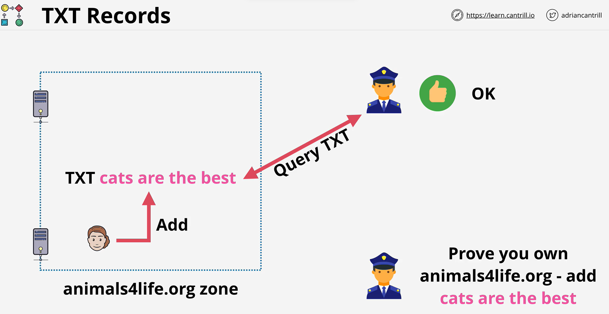

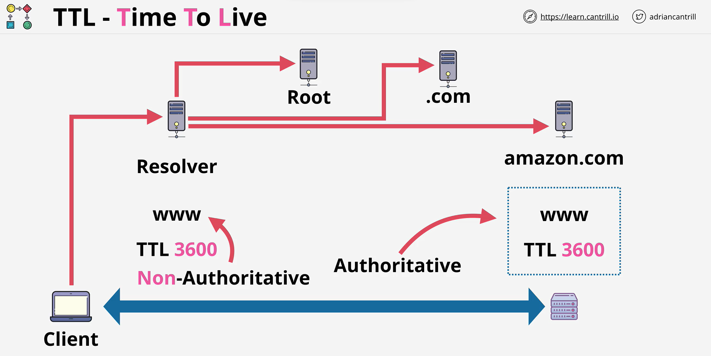
