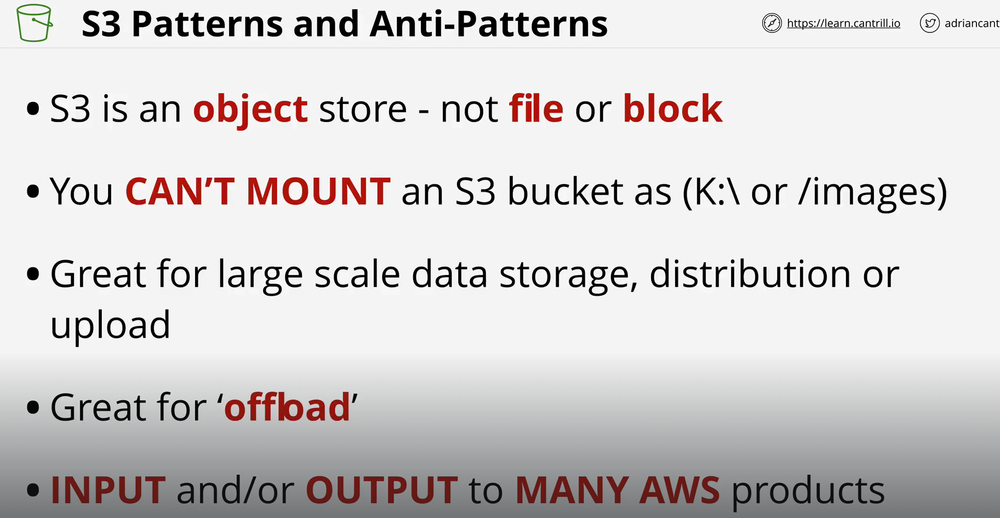
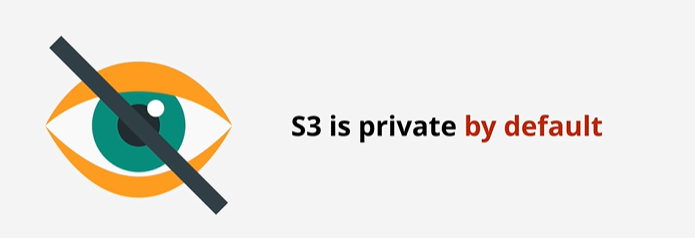
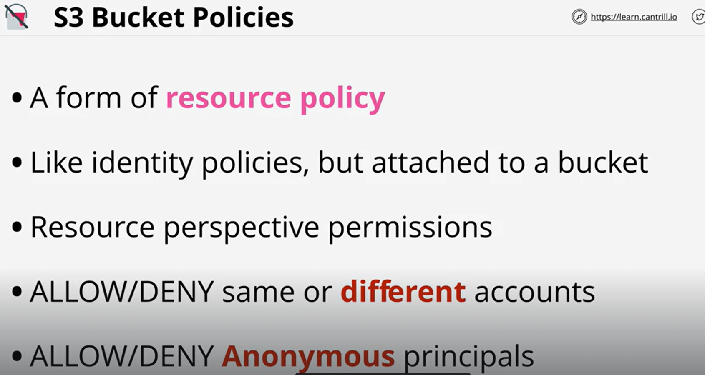
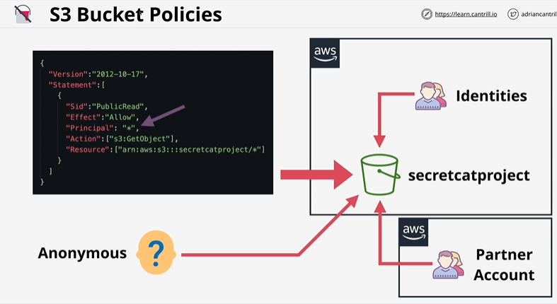
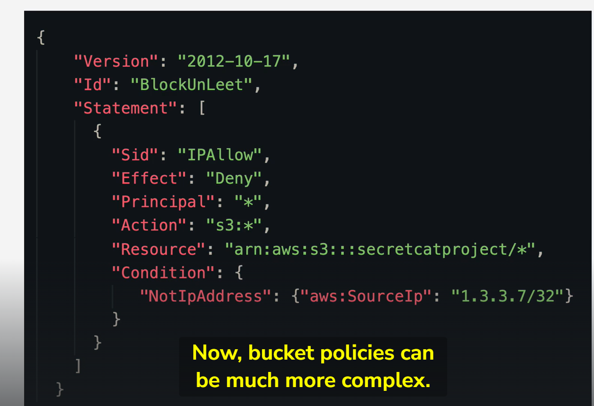
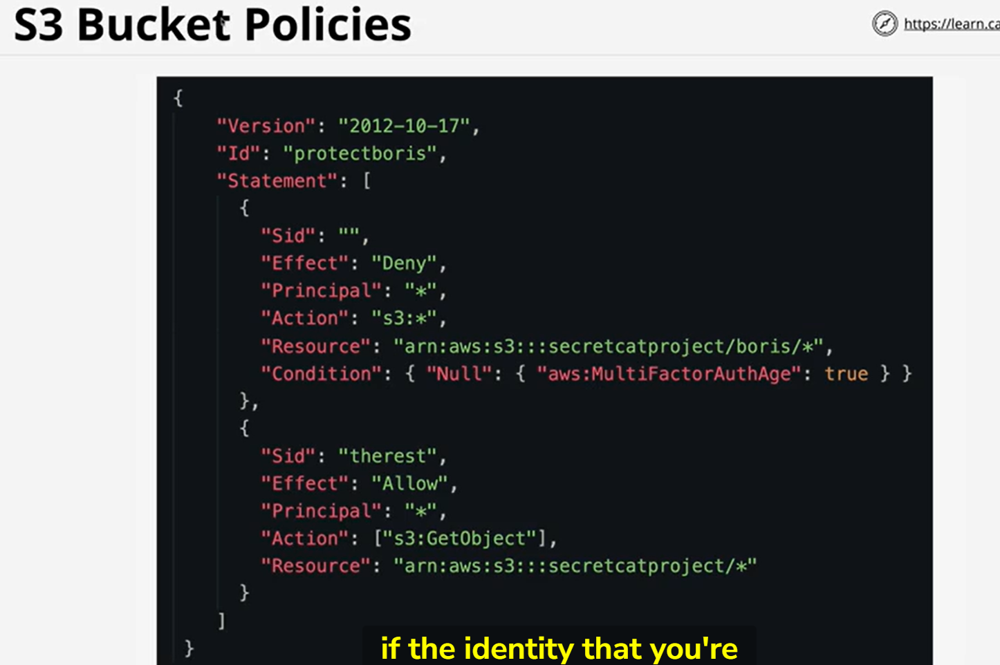
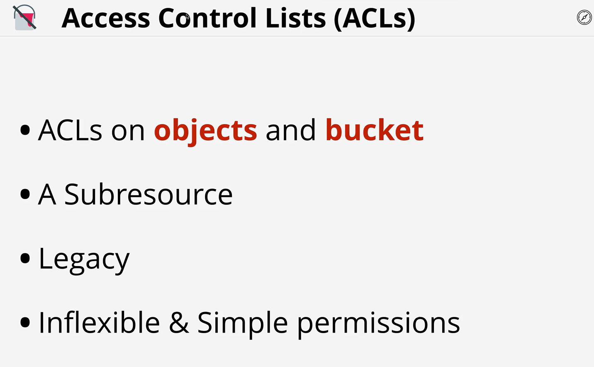
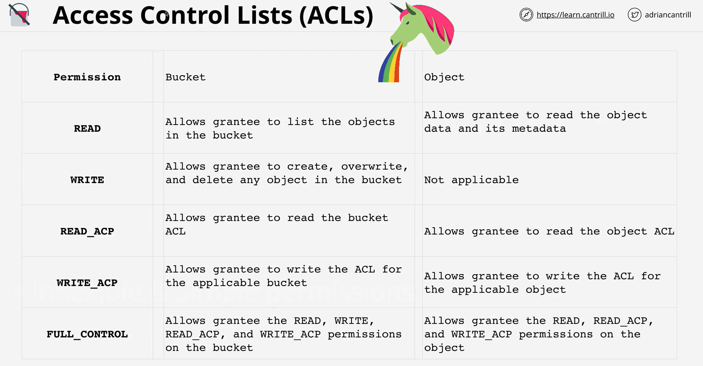
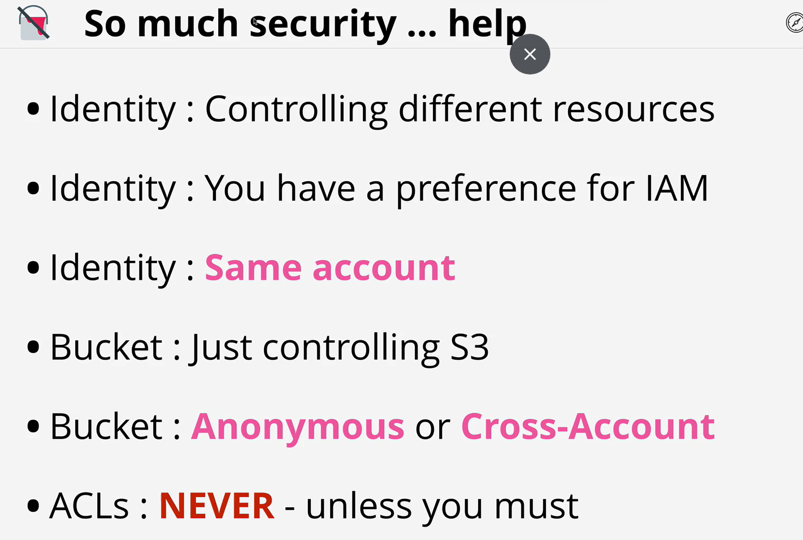

## s3 Basics

## First s3 Bucket Handson

[https://learn.cantrill.io/courses/1820301/lectures/41301625]

---

## s3 Security

[https://learn.cantrill.io/courses/1820301/lectures/41301469]

* With identity policies we are controlling what that identity can access
* With resource policies we are controlling what that resource can access
* Identity policies can only be defined in your own account

*Resource policies allow one to control access in own account and other accounts*

*Resource policies allow setting anonymous principals unlike identity policies*

*This bucket policy doesn't allow access if the IP is not the given source IP*

*In the above example, the access to boris folder is denied, if the Identity doesn't use a MFA. This will override the 2nd statement which allows access to other buckets*

##### Bucket Policy examples Link

[https://docs.aws.amazon.com/AmazonS3/latest/userguide/example-bucket-policies.html]

## s3 Static Web Hosting

[https://learn.cantrill.io/courses/1820301/lectures/41301470]
