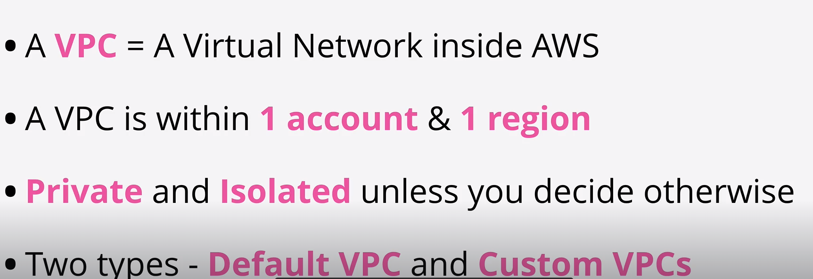

## IP Addressing Primer 

[https://youtu.be/g2JOHLHh4rI?si=wfHnQAAbBA3HIrfB&t=164]

- 255.0.0.0 means /8 = 32-8 = 2^24 = 16777216 (But we are not allowed 2 IP addresses hence) = 16777214
- 255.255.0.0 means /16 = 32-16 = 2^16 = 65536 (But we are not allowed 2 IP addresses hence) = 65534
- 255.255.255.0 means /24  = 32-24 = 2^8 = 256 (But we are not allowed 2 IP addresses hence) = 254

## Default VPC

[https://learn.cantrill.io/courses/1820301/lectures/41301619]

**Note - We can have only 1 Default VPC per region**

## Custom VPCs

*Custom VPCs are by default private*

Default VPC has CIDR value of 172.31.0.0/16

## Default VPC Setup (in a region)

**The Highter the /x number is, the smaller the network is**

## Default VPC Facts

## Default VPC Setup (Handson)

[https://learn.cantrill.io/courses/1820301/lectures/41301619]

