## AWS Public vs Private Services

[https://learn.cantrill.io/courses/1820301/lectures/41301617]

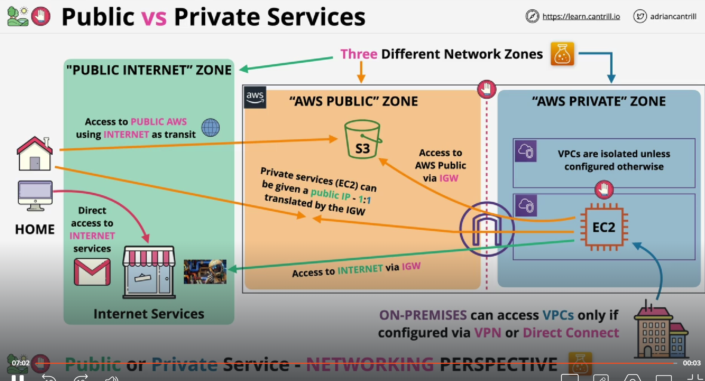

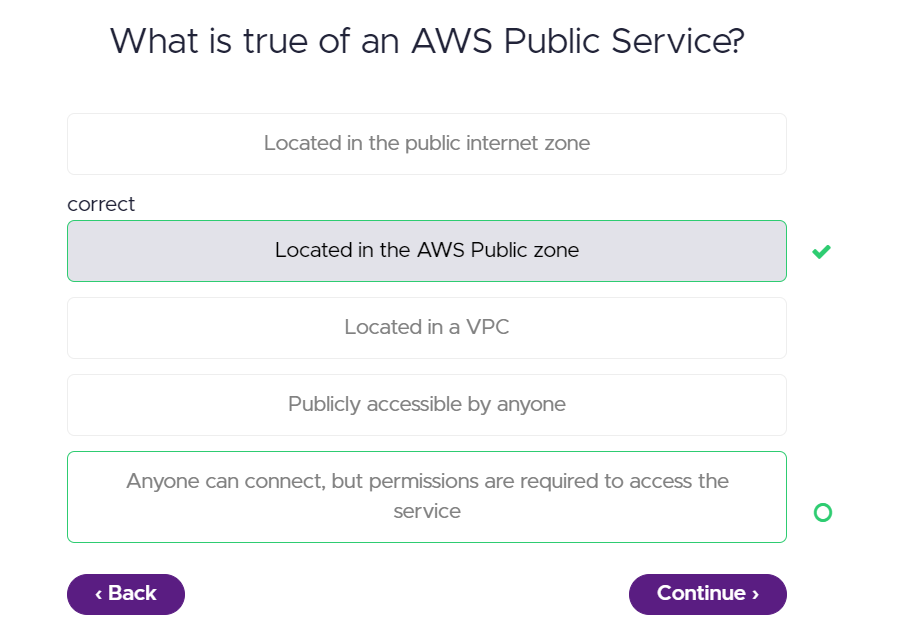

## AWS Global Infrastructure

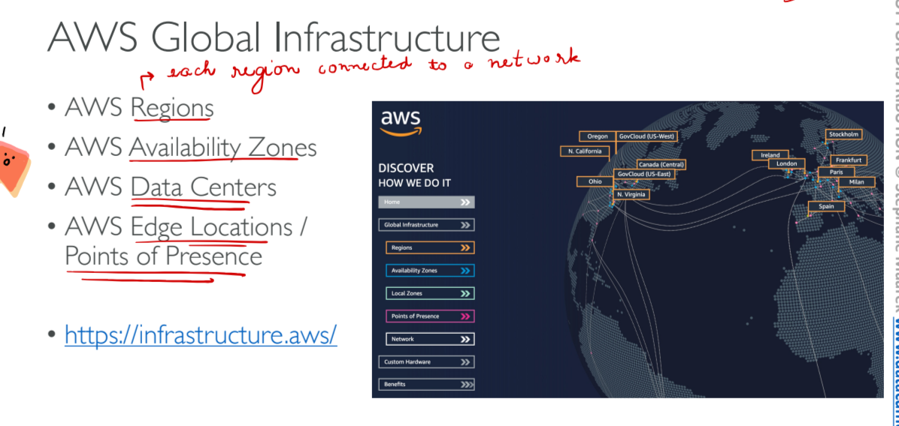

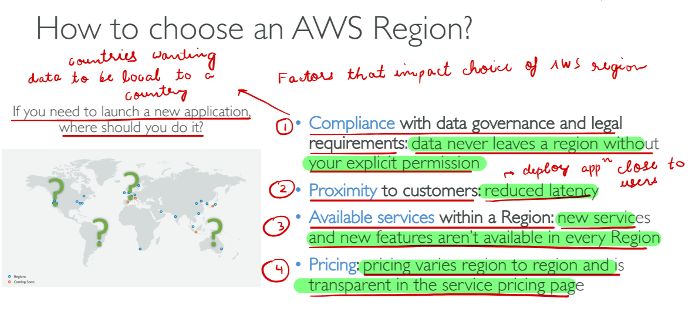

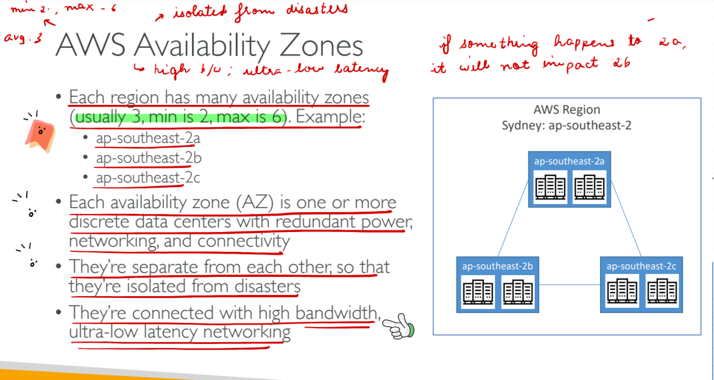

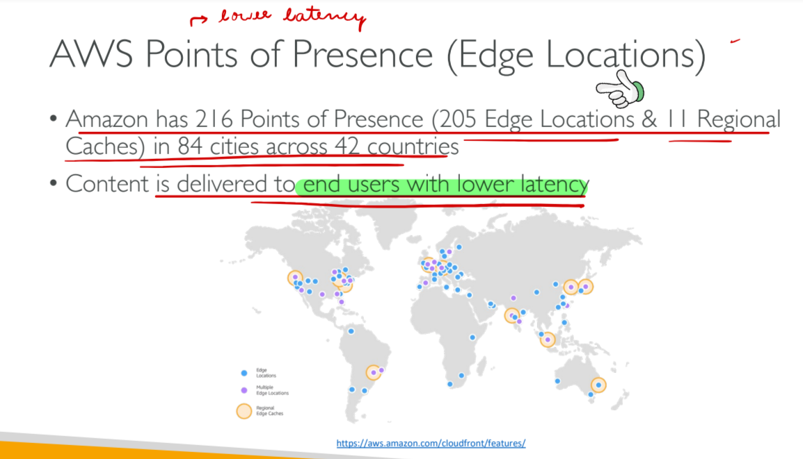

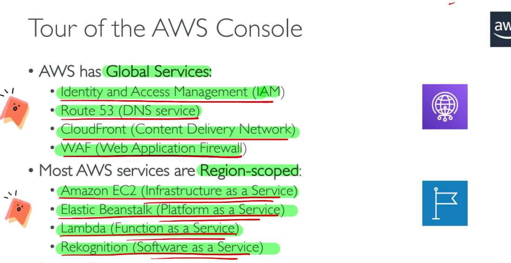

## Shared Responsibility Model

[https://learn.cantrill.io/courses/1820301/lectures/41301630]

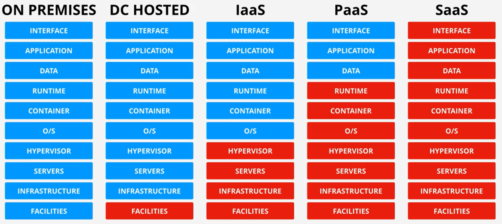

## High Availability vs Fault Tolerance vs Disaster Recovery

[https://learn.cantrill.io/courses/1820301/lectures/41301631]

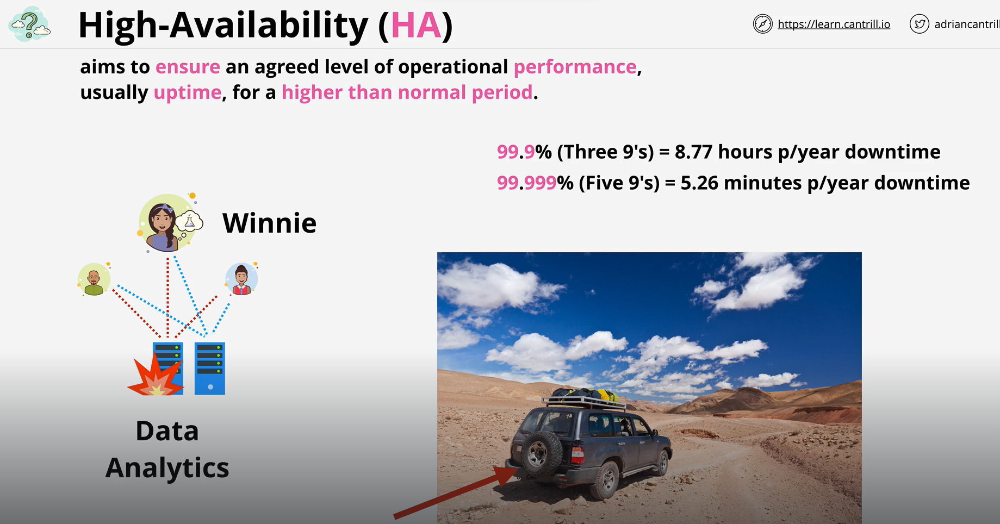

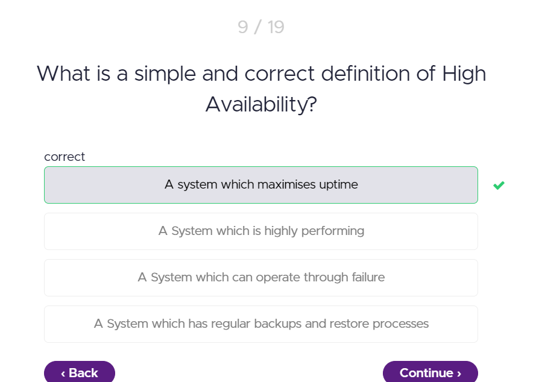

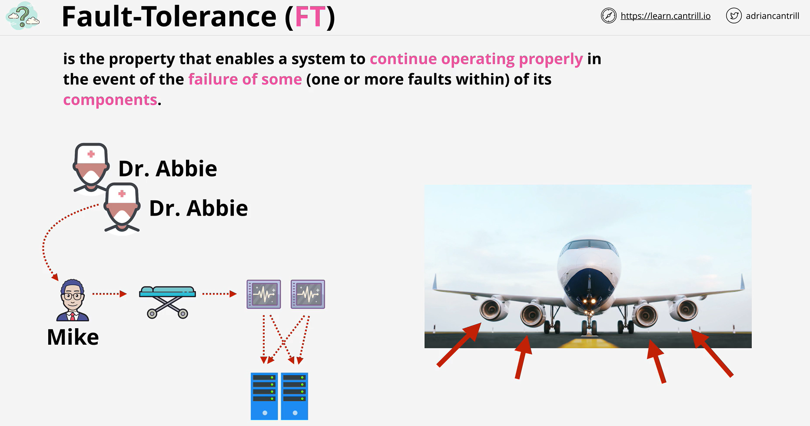

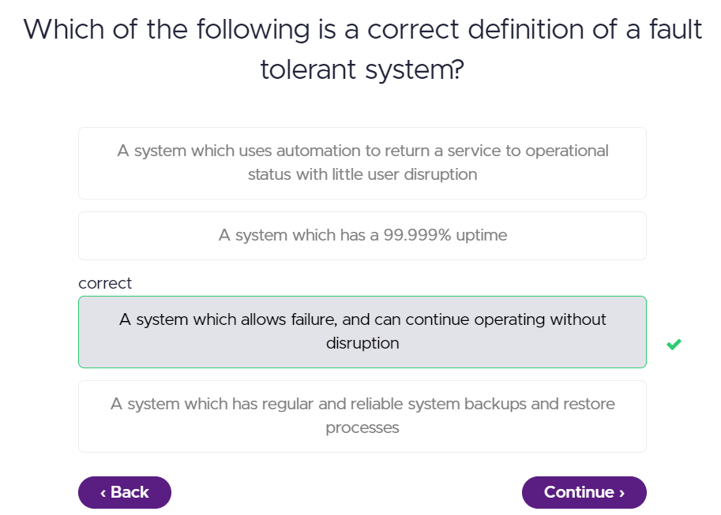

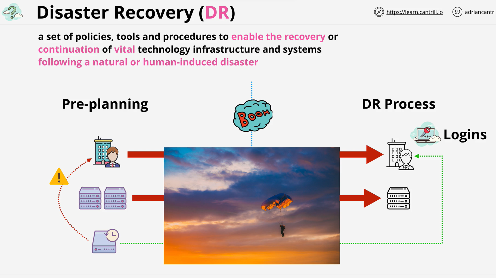

