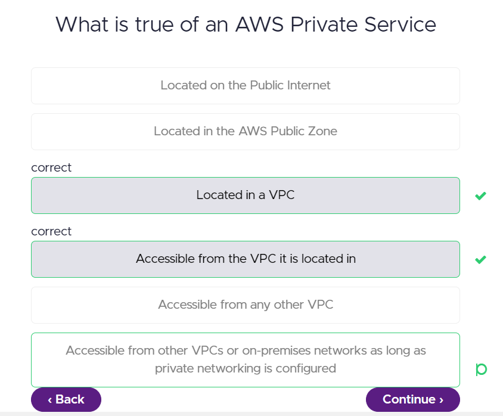
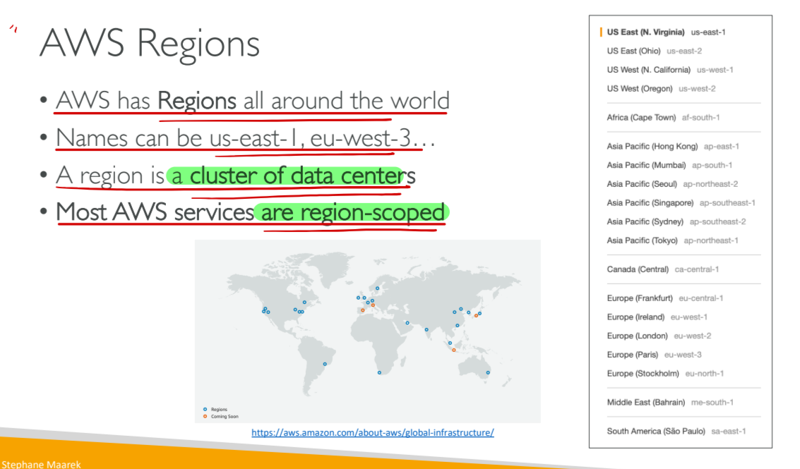
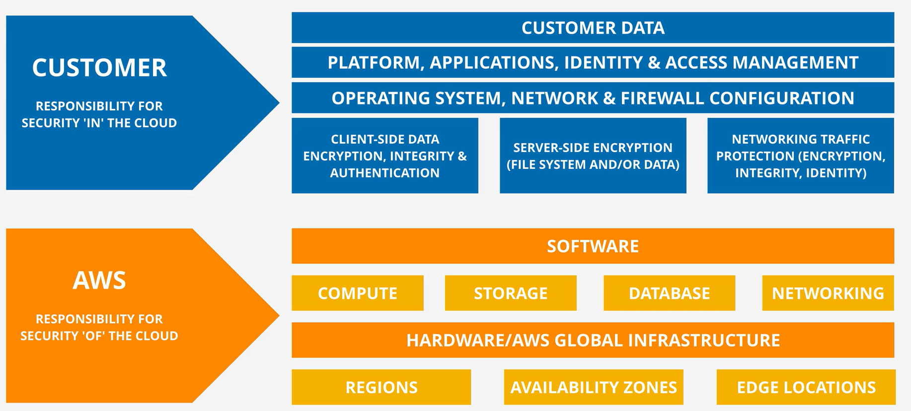
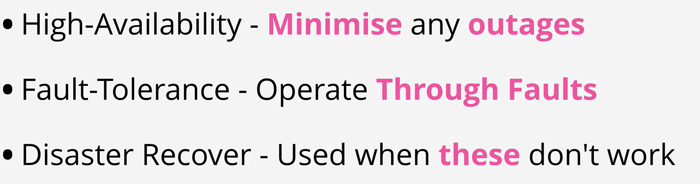

## AWS Public vs Private Services

[https://learn.cantrill.io/courses/1820301/lectures/41301617]

## AWS Global Infrastructure

## Shared Responsibility Model

[https://learn.cantrill.io/courses/1820301/lectures/41301630]

## High Availability vs Fault Tolerance vs Disaster Recovery

[https://learn.cantrill.io/courses/1820301/lectures/41301631]

