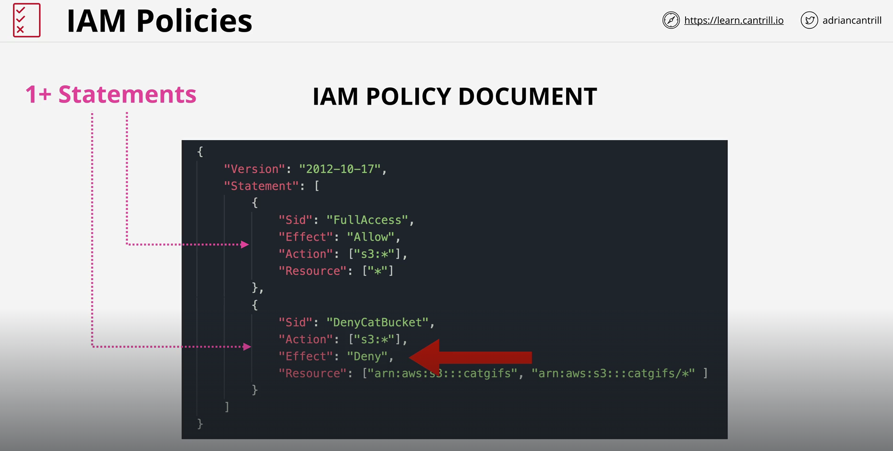
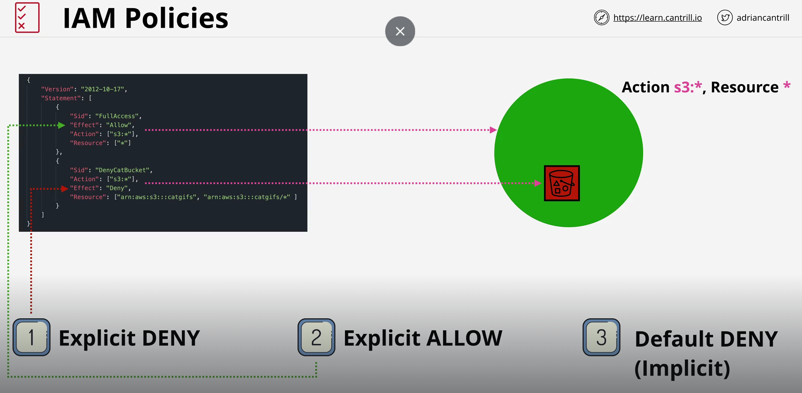
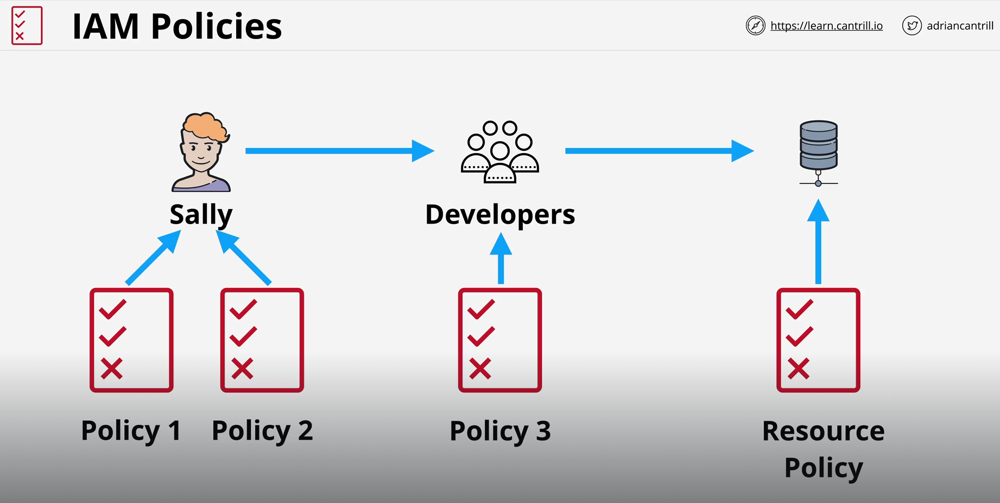
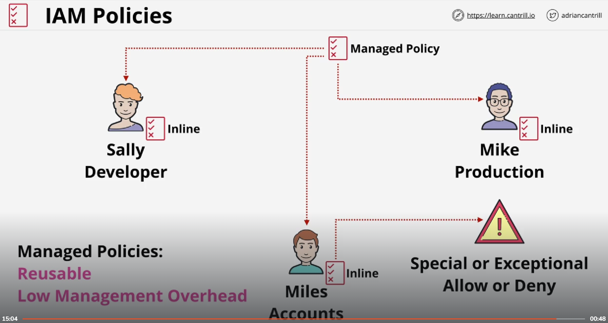
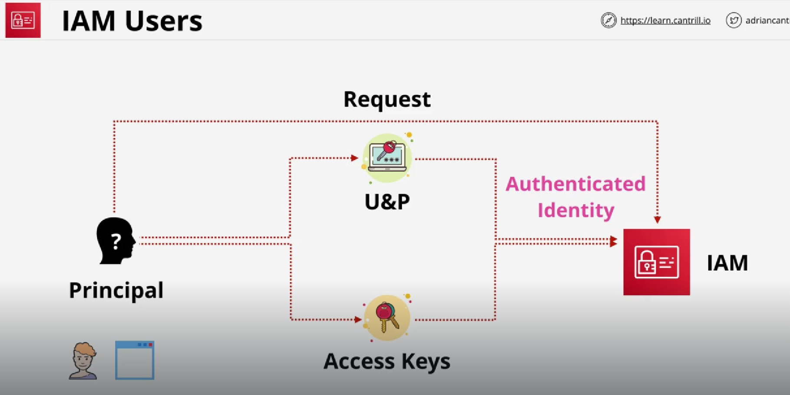
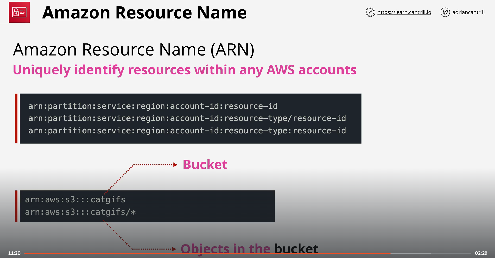
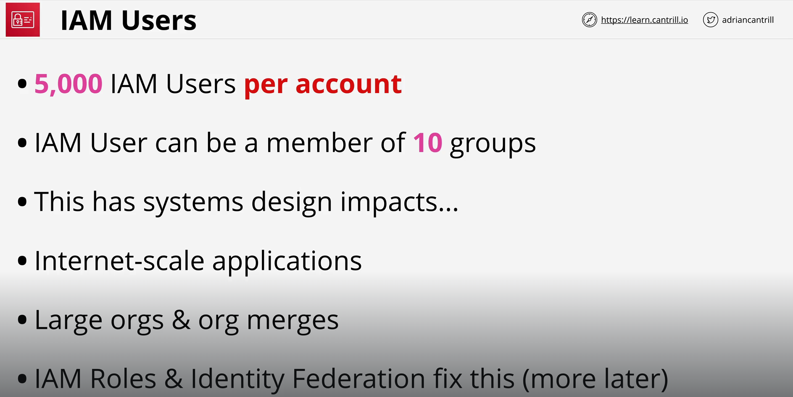
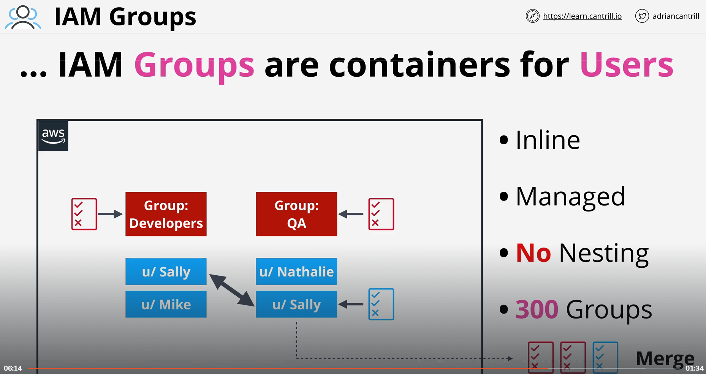
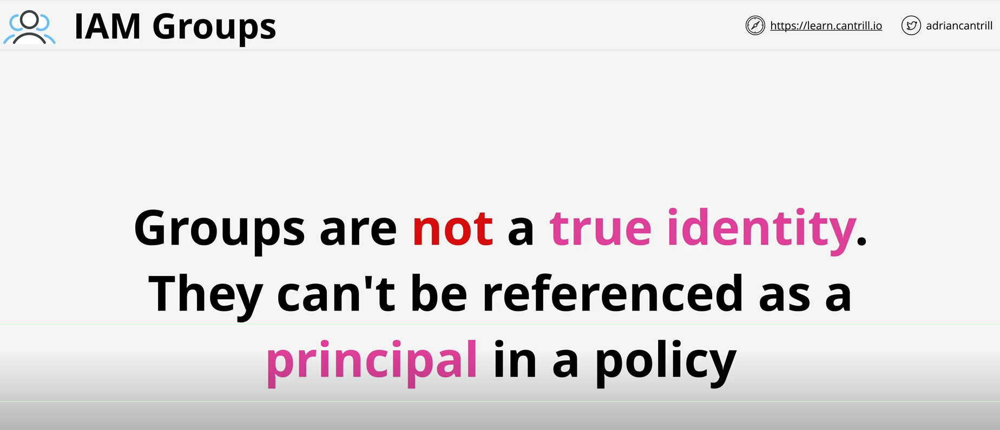

# IAM Basics (IMP)

https://learn.cantrill.io/courses/1820301/lectures/41301464

# Adding IAMADMIN to GENERAL Account (Handson)

https://learn.cantrill.io/courses/1820301/lectures/41301465

# Adding IAMADMIN to PRODUCTION Account (Handson)

https://learn.cantrill.io/courses/1820301/lectures/41301466

# IAM Access Key Basics 

https://learn.cantrill.io/courses/1820301/lectures/41301467

# Creating Access keys and setting up AWS CLI v2 tools (Handson)

https://learn.cantrill.io/courses/1820301/lectures/41301468

# IAM Identity Policies

https://learn.cantrill.io/courses/aws-certified-solutions-architect-associate-saa-c03/lectures/41301362

- Explicit deny always takes higher priority

# IAM Users and ARN

https://learn.cantrill.io/courses/aws-certified-solutions-architect-associate-saa-c03/lectures/41301363

# Simple Identity Permissions in AWS (Handson)

https://learn.cantrill.io/courses/aws-certified-solutions-architect-associate-saa-c03/lectures/41301364

# IAM Groups

https://learn.cantrill.io/courses/aws-certified-solutions-architect-associate-saa-c03/lectures/41301365

# Permissions control using IAM Groups (Handson)

https://learn.cantrill.io/courses/aws-certified-solutions-architect-associate-saa-c03/lectures/41301366

# IAM Roles - The Tech (To be done)

https://learn.cantrill.io/courses/aws-certified-solutions-architect-associate-saa-c03/lectures/41301367
